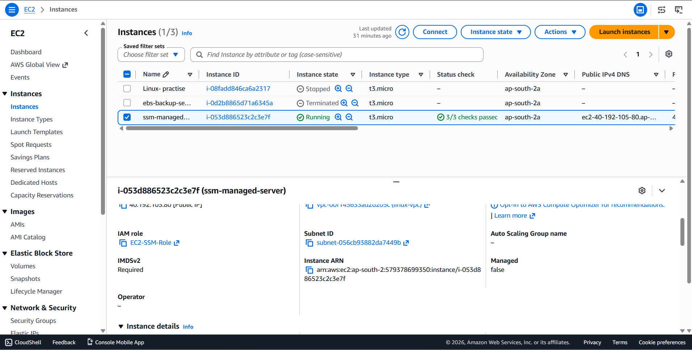
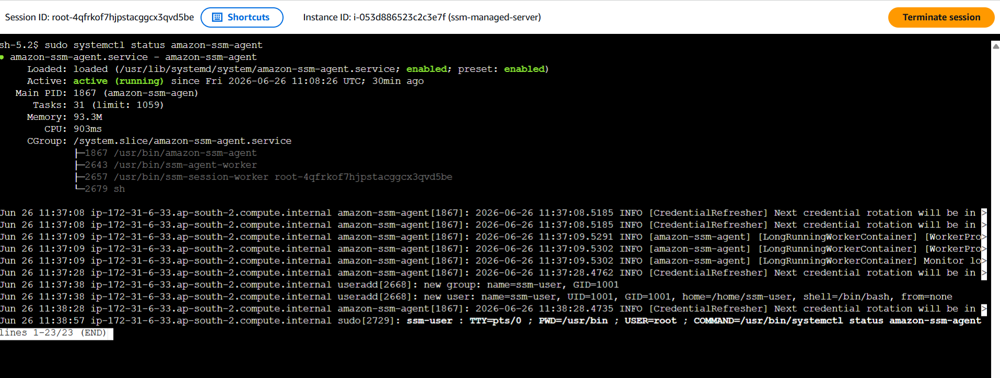
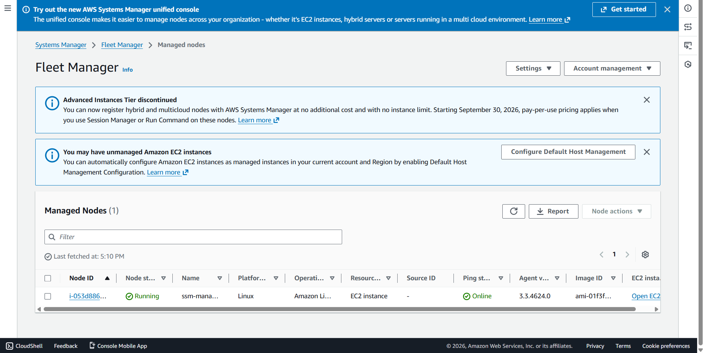
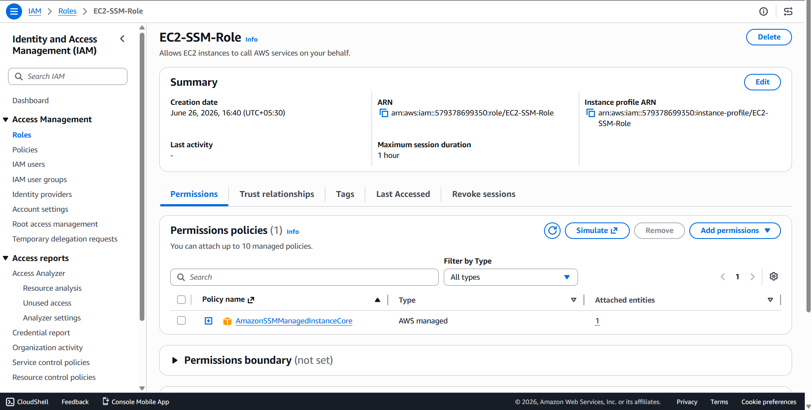

# AWS Systems Manager (SSM) - Managing EC2 Instances Without SSH

## Project Overview

This project demonstrates how to securely manage Amazon EC2 instances using AWS Systems Manager (SSM) without using SSH keys or opening port 22.

AWS Systems Manager provides secure and centralized management of EC2 instances through Session Manager and Fleet Manager.

## Architecture

Amazon EC2 Instance → IAM Role → AWS Systems Manager → Session Manager → Fleet Manager

## AWS Services Used

* Amazon EC2
* AWS Systems Manager (SSM)
* AWS Identity and Access Management (IAM)
* Session Manager
* Fleet Manager

## Project Steps

### 1. Launched an Amazon EC2 Instance

* Created an EC2 instance using Amazon Linux 2023.
* Used the default VPC and security settings.

### 2. Created an IAM Role for Systems Manager

Created an IAM role with the following policy attached:

```text
AmazonSSMManagedInstanceCore
```

### 3. Attached the IAM Role to the EC2 Instance

Attached the IAM role to the EC2 instance to allow Systems Manager to communicate with the instance securely.

### 4. Verified the SSM Agent

Verified that the Amazon SSM Agent was installed and running on the EC2 instance.

```bash
sudo systemctl status amazon-ssm-agent
```

### 5. Connected to EC2 Using Session Manager

Connected to the EC2 instance directly from the AWS Management Console using Session Manager without using SSH keys.

### 6. Verified Managed Node Status

Verified that the EC2 instance appeared as a managed node in AWS Systems Manager Fleet Manager.

## Key Features

* Secure EC2 management without SSH access.
* No need to open inbound port 22.
* Browser-based terminal access using Session Manager.
* Centralized management through Fleet Manager.
* Enhanced security and simplified administration.

## Benefits of AWS Systems Manager

* Eliminates the need for SSH keys.
* Improves security by avoiding public SSH access.
* Enables centralized management of multiple EC2 instances.
* Supports automation and remote administration.

## Screenshots

### EC2 Instance with IAM Role Attached


### Session Manager Connection


### Fleet Manager - Managed Node


### IAM Role with AmazonSSMManagedInstanceCore Policy


## Project Outcome

Successfully managed an Amazon EC2 instance using AWS Systems Manager without SSH access and explored secure instance administration using Session Manager and Fleet Manager.

## Key Learnings

* AWS Systems Manager architecture
* Session Manager
* Fleet Manager
* IAM Roles and Policies
* Secure EC2 administration
* Agent-based server management

## Author

**Divya Vemulapalli**
